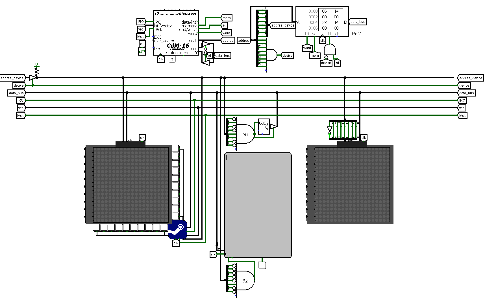

# Battleship in Logisim (CdM-16 Architecture)

A complete hardware-software implementation of the classic "Battleship" game, built from scratch within the Logisim digital logic simulator. The project runs on the 16-bit educational processor CdM-16, featuring custom-designed peripheral devices, memory-mapped I/O, and an AI opponent written in C.

**GIF of gameplay**

**Figure 1:** General overview of the Logisim circuit.

## Project Overview

This project demonstrates the full stack of computer architecture, bridging low-level hardware design (circuit routing, interrupt controllers, displays) with software engineering (game logic, memory optimization, AI state machines). 

### Key Features
* **Custom Memory-Mapped I/O:** Hardware devices are controlled via the upper 8 bits of the 16-bit address bus, supporting up to 256 unique peripheral addresses.
* **Hardware Interrupt Controller:** A custom 20-button keypad grid generates hardware IRQs specifically synchronized with the game loop to prevent debouncing and false triggers.
* **Multiplexed 3-Color Displays:** Dual 10x10 LED matrices capable of displaying 3 distinct colors by exploiting logic gate error states natively in Logisim.
* **Autonomous AI Opponent:** A finite state machine (FSM) based bot with Search and Destroy modes, utilizing a hardware Random Number Generator (RNG) for decision making.
* **Highly Optimized C Logic:** Uses 1D arrays for 2D grids, bitwise state encoding, and memory padding ("invisible borders") to minimize CPU cycles on boundary checks.

---

## Hardware Architecture

The physical logic layer includes four main peripheral modules connected to the CdM-16 processor:

1. **Player & Bot Monitors:** * Each monitor is a 10x10 matrix.
   * Row addressing allows line-by-line updates via 10-bit bitmasks.
   * Color generation is achieved through a 2-bit counter multiplexing: logic `0` (Color 1), logic `error` (Color 2), and logic `1` (Color 3).
2. **Interactive Cannon (Keypad):**
   * Hardware registers store the X and Y coordinates selected by the user.
   * Triggers an interrupt to the CPU only when the system is in the "Player's Turn" state.
3. **Hardware RNG:**
   * A dedicated circuit that outputs a 16-bit pseudorandom number directly to the data bus upon request.
4. **System Terminal:**
   * A TTY component used for system logging and state indication (e.g., `--- PLAYER'S TURN ---`, `Hit!`, `*sank*`).

## Software Architecture

The software is written in C and compiled for the CdM-16 architecture. 

* **Game Loop:** Turn-based execution. A hit grants an extra turn, a miss hands control to the opponent.
* **Map Generation (`random_map_of_bot`):** Automated, constraint-based placement of ships ensuring no overlap or adjacency violations (`check_rules`).
* **Sinking Logic (`make_frame`):** Automatically calculates and marks the surrounding "aura" of a destroyed ship to prevent redundant shots.
* **AI Bot:** Operates in two states:
  1. *Random Fire:* Queries the hardware RNG for valid targets.
  2. *Target Lock:* Upon a hit, switches to an adjacent-cell search algorithm. After two consecutive hits, it computes the alignment vector and fires along the line until the target is destroyed.

---

## Getting Started

### Prerequisites
* [Logisim](http://www.cburch.com/logisim/) (or the specific fork used, e.g., Logisim-Evolution)
* CdM-16 Processor emulator/toolchain

### How to Run
1. Clone the repository: `git clone https://github.com/YourUsername/logisim-battleship.git`
2. Open the `battleship_circuit.circ` file in Logisim.
3. Load the compiled binary into the ROM/RAM components of the CdM-16 processor.
4. Start the clock simulation (Ctrl+T / Cmd+T) to begin the boot sequence.

